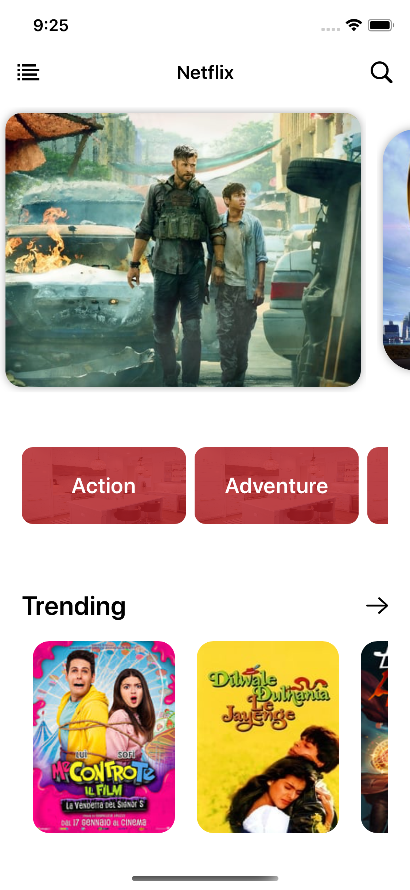
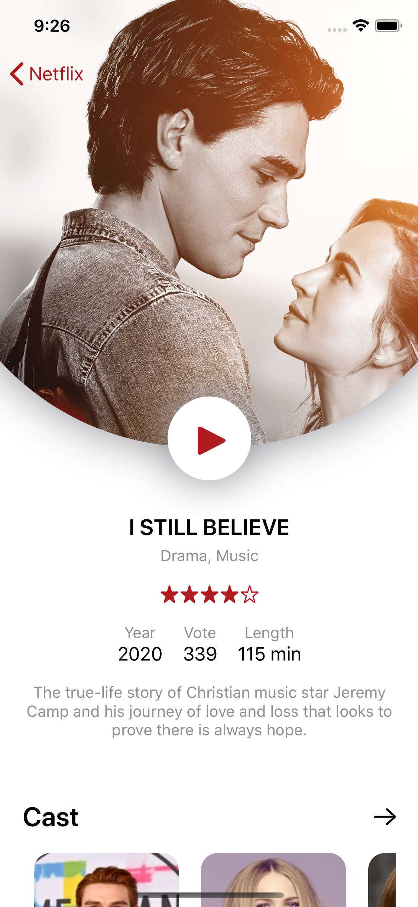
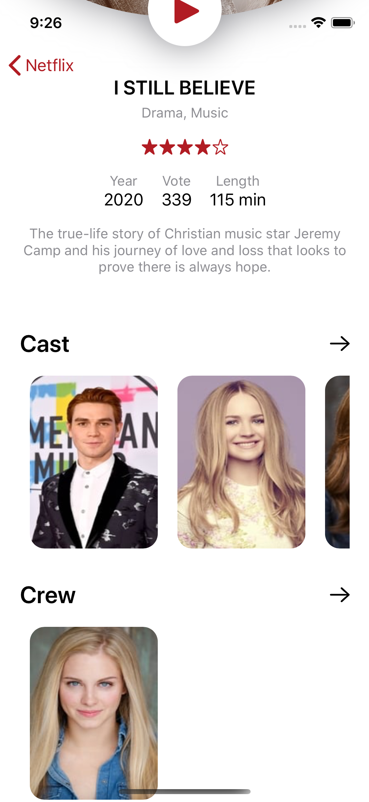

# mini-netflix-clone
Mini Netflix clone in SwiftUI with Networking

<h3>Screenshots</h3>
<h4>Homepage</h4>

<h4>Property Detail</h4>

<h2>How to use or install</h2>
1. Create account in TMDB (https://www.themoviedb.org) and apply for API key
2. After generating API key then this key paste into API_KEY variable in Constant/Constant.swift file. 

<h2>Credits</h2>
<h3>Design Credit</h3>

https://dribbble.com/shots/5026483-Netflix-Mobile-App-Redesign

<h3>Icons</h3>

https://www.flaticon.com/

